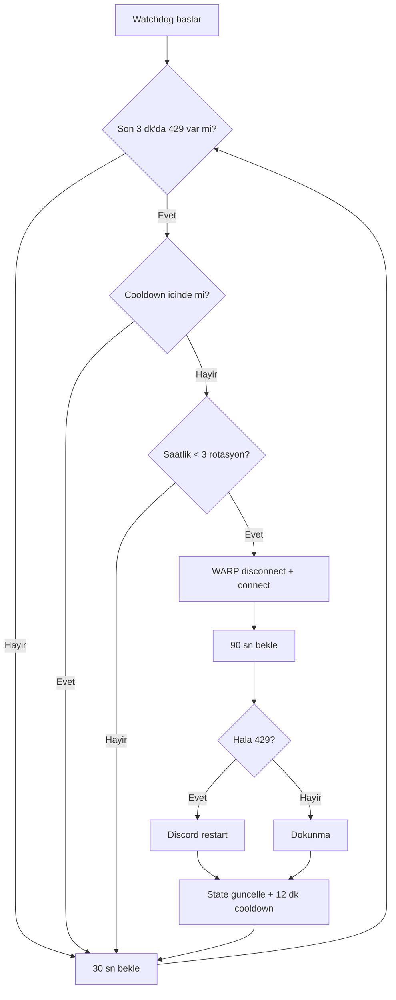

<div align="center">


# Discord 429 Watchdog

**Discord "Messages Failed To Load" / HTTP 429 için otomatik kurtarma**

Cloudflare WARP üzerinde rate-limit yiyen hesapları kurtaran, IP rotasyonu yapan Windows watchdog.

[](LICENSE)
[](#)
[](#)
[](https://1.1.1.1/)
[](#)

[Özellikler](#özellikler) •
[Hızlı Başlangıç](#hızlı-başlangıç) •
[Nasıl Çalışır?](#nasıl-çalışır) •
[Parametreler](#parametreler) •
[SSS](#sss)

</div>

---

## Sorun

Discord'da mesajlar yüklenmiyor:

<p align="center">
  
</p>

Konsolda / log'da:

```
HTTPResponseError: GET /users/xxx/profile [429]
HTTPResponseError: POST /channels/xxx/messages/xxx/ack [429]
[MessageActionCreators] Failed to fetch messages for ...
```

### Neden olur?

| Adım | Açıklama |
|------|----------|
| 1 | ISP (DNS/SNI DPI) Discord'u engeller → **WARP gerekir** |
| 2 | WARP sizi datacenter IP'si ile çıkarır (ör. `104.28.x.x`) |
| 3 | Discord bu IP havuzunu agresif rate-limit'ler → **429** |
| 4 | `Retry-After: 0` + sürekli retry = "Messages Failed To Load" |

Tek seferlik elle çözüm: `warp-cli disconnect` → `connect` (bazen yeni IP yeter).

**Bu araç bunu otomatik ve kontrollü yapar.**

---

## Çözüm

```
429 algıla → WARP IP rotasyonu → gerekirse Discord restart → cooldown
```

- ⏱ 12 dk cooldown (spam yok)
- 🔁 Saatlik en fazla 3 rotasyon
- 🧑‍🤝‍🧑 Her Windows kullanıcısı kendi instance'ını çalıştırır
- 🔒 Mutex ile çift çalışma engelli

---

## Özellikler

- [x] Discord `renderer_js.log` üzerinden `429` / `Failed to fetch messages` algılama
- [x] Otomatik `warp-cli disconnect` → `connect` (IP rotasyonu)
- [x] Hâlâ hata varsa tek seferlik Discord restart
- [x] Scheduled Task ile **tüm kullanıcılar** için login'de otomatik başlangıç
- [x] Manuel çalıştırma (`.bat` / `.lnk`)
- [x] Kaldırma script'i (`kaldir.bat`)
- [x] Kullanıcıya özel log + state (`%LOCALAPPDATA%`)
- [x] MIT lisanslı, tek script, bağımlılık yok (PowerShell 5.1+)

---

## Hızlı Başlangıç

### Yöntem 1 — Otomatik kurulum (öneri)

```powershell
git clone https://github.com/brkNx/discord-429-watchdog-warp-zero-trust--loading-.git
cd discord-429-watchdog-warp-zero-trust--loading-
# kur.bat → sağ tık → Yönetici olarak çalıştır
```

Veya repo sayfasından **Code → Download ZIP** indirip `kur.bat` dosyasına **Yönetici olarak çalıştır** deyin.

### Yöntem 2 — Manuel

```powershell
powershell -NoProfile -ExecutionPolicy Bypass -File .\Discord429Watchdog.ps1
```

### Yöntem 3 — Kaldır

`kaldir.bat` → **Yönetici olarak çalıştır**

---

## Parametreler

| Parametre | Varsayılan | Açıklama |
|-----------|------------|----------|
| `-CheckIntervalSeconds` | `30` | Log kontrol aralığı (sn) |
| `-CooldownMinutes` | `12` | Kurtarma sonrası bekleme (dk) |
| `-Once` | — | Tek kontrol yapıp çık |
| `-Force` | — | 429 beklemeden hemen kurtar (tek sefer) |

Örnek:

```powershell
# Agresif: 15 sn kontrol, 10 dk cooldown
.\Discord429Watchdog.ps1 -CheckIntervalSeconds 15 -CooldownMinutes 10

# Tek seferlik test
.\Discord429Watchdog.ps1 -Force -Once
```

---

## Nasıl Çalışır?



---

## Dosya Yapısı

```
discord-429-watchdog/
├── Discord429Watchdog.ps1    # Ana script (watchdog)
├── Discord429Watchdog.bat    # Manuel çalıştırıcı
├── kur.bat                   # Scheduled Task kaydı (admin)
├── kaldir.bat                # Görevi siler (admin)
├── assets/
│   ├── logo.svg
│   └── messages-failed-to-load.png
├── README.md
└── .gitignore
```

---

## Log / Tanı

| Dosya | Yol |
|-------|-----|
| Watchdog log | `%LOCALAPPDATA%\discord-429-watchdog.log` |
| State | `%LOCALAPPDATA%\discord-429-watchdog.state` |
| Discord log | `%APPDATA%\discord\logs\renderer_js.log` |

İzle:

```powershell
Get-Content "$env:LOCALAPPDATA\discord-429-watchdog.log" -Wait
```

Görev durumu:

```powershell
Get-ScheduledTask -TaskName Discord429Watchdog
```

---

## SSS

**WARP olmadan çalışır mı?**  
Hayır. ISP engelini WARP aşar; watchdog sadece WARP IP'sine gelen 429 rate-limit'ini çözer.

**Zero Trust / Teams organizasyonunda?**  
Evet. `warp-cli disconnect/connect` organizasyonu bozmaz. Endpoint değiştirmek privileged ister — bu script sadece reconnect yapar.

**Her kullanıcıyı etkiler mi?**  
Hayır. Script ortak (`ProgramData`), log/state ve mutex **kullanıcıya özeldir**. Her hesap kendi Discord'u için ayrı çalışır.

**429 saatlik limiti aşılırsa?**  
Watchdog bekleme moduna geçer; spam yapmaz. Cooldown sonra tekrar dener.

**Saatlik 3 rotasyon yetmezse?**  
`MaxRotationsPerHour` değerini script içinde artırabilirsiniz (varsayılan spam koruması).

---

## Gereksinimler

- Windows 10 / 11
- [Cloudflare WARP](https://1.1.1.1/) (`warp-cli` PATH'te)
- Discord (masaüstü)
- PowerShell 5.1+ (Windows ile gelir)

---

## Lisans

[MIT](LICENSE) © [brkNx](https://github.com/brkNx)

---

<div align="center">

⭐ Bu proje işine yaradıysa **star** atmayı unutma.

Made for Discord + WARP users who hit **429**.

</div>
