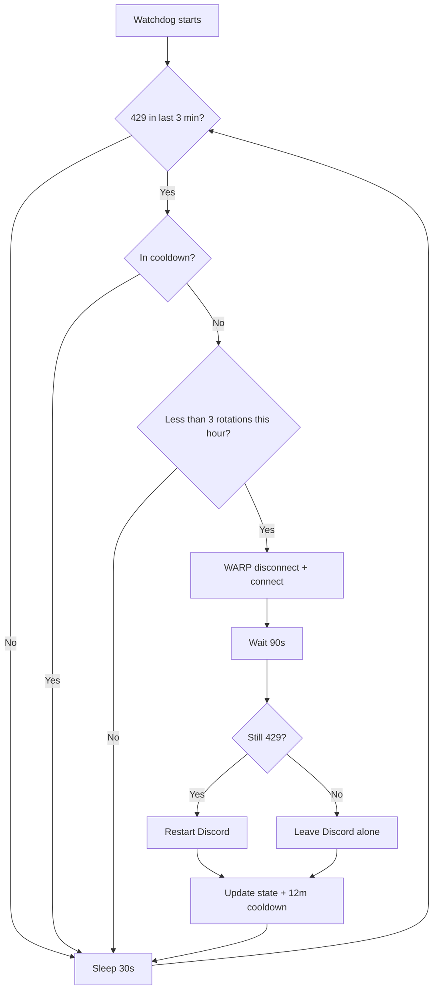

<div align="center">


# Discord 429 Watchdog

**Automatic recovery for Discord "Messages Failed To Load" / HTTP 429 errors**

A Windows watchdog that recovers rate-limited Discord sessions behind Cloudflare WARP by rotating the exit IP.

[](LICENSE)
[](#)
[](#)
[](https://1.1.1.1/)
[](#)

[Features](#features) •
[Quick Start](#quick-start) •
[How It Works](#how-it-works) •
[Parameters](#parameters) •
[FAQ](#faq)

</div>

---

## The Problem

Discord messages fail to load:

<p align="center">
  
</p>

In the console / logs:

```
HTTPResponseError: GET /users/xxx/profile [429]
HTTPResponseError: POST /channels/xxx/messages/xxx/ack [429]
[MessageActionCreators] Failed to fetch messages for ...
```

### Why it happens

| Step | What goes wrong |
|------|-----------------|
| 1 | ISP blocks Discord (DNS/SNI DPI) → **WARP is required** |
| 2 | WARP egresses you through a datacenter IP (e.g. `104.28.x.x`) |
| 3 | Discord aggressively rate-limits those IP pools → **429** |
| 4 | `Retry-After: 0` + endless retries = "Messages Failed To Load" |

Manual one-shot fix: `warp-cli disconnect` → `connect` (sometimes a new IP is enough).

**This tool automates that recovery safely.**

---

## Solution

```
detect 429 → rotate WARP IP → restart Discord if needed → cooldown
```

- ⏱ 3-minute cooldown (no spam)
- 🔁 Max 15 rotations per hour
- 🧑‍🤝‍🧑 Each Windows user runs their own instance
- 🔒 Mutex prevents double runs

---

## Features

- [x] Detects `429` / `Failed to fetch messages` in Discord `renderer_js.log`
- [x] Automatic route healing (restores split-tunnel Discord routes on WARP interface)
- [x] Automatic `warp-cli disconnect` → `connect` (IP rotation)
- [x] Single controlled Discord restart if errors persist
- [x] Scheduled Task starts on **every user** logon
- [x] Manual runner (`.bat` / shortcut)
- [x] Uninstaller (`uninstall.bat`)
- [x] Per-user log + state (`%LOCALAPPDATA%`)
- [x] MIT licensed, single script, no dependencies (PowerShell 5.1+)

---

## Quick Start

### Option 1 — Automated install (recommended)

```powershell
git clone https://github.com/brkNx/discord-429-watchdog-warp-zero-trust--loading-.git
cd discord-429-watchdog-warp-zero-trust--loading-
# install.bat → right-click → Run as administrator
```

Or download **Code → Download ZIP** from the repo page and run `install.bat` **as administrator**.

### Option 2 — Manual run

```powershell
powershell -NoProfile -ExecutionPolicy Bypass -File .\Discord429Watchdog.ps1
```

### Option 3 — Uninstall

`uninstall.bat` → **Run as administrator**

---

## Parameters

| Parameter | Default | Description |
|-----------|---------|-------------|
| `-CheckIntervalSeconds` | `20` | Log check interval (seconds) |
| `-CooldownMinutes` | `3` | Wait after recovery (minutes) |
| `-PostRotationWaitSeconds` | `15` | Wait time after IP rotation before verifying recovery (seconds) |
| `-Once` | — | Single check then exit |
| `-Force` | — | Recover immediately without waiting for a 429 (single run) |

Examples:

```powershell
# Aggressive: check every 15s, 10m cooldown
.\Discord429Watchdog.ps1 -CheckIntervalSeconds 15 -CooldownMinutes 10

# One-shot test
.\Discord429Watchdog.ps1 -Force -Once
```

---

## How It Works



---

## File Structure

```
discord-429-watchdog/
├── Discord429Watchdog.ps1    # Main watchdog script
├── Discord429Watchdog.bat    # Manual runner
├── install.bat               # Registers Scheduled Task (admin)
├── uninstall.bat             # Removes the task (admin)
├── assets/
│   ├── logo.svg
│   └── messages-failed-to-load.png
├── README.md
├── LICENSE
└── .gitignore
```

---

## Logs & Diagnostics

| File | Path |
|------|------|
| Watchdog log | `%LOCALAPPDATA%\discord-429-watchdog.log` |
| State | `%LOCALAPPDATA%\discord-429-watchdog.state` |
| Discord log | `%APPDATA%\discord\logs\renderer_js.log` |

Watch live:

```powershell
Get-Content "$env:LOCALAPPDATA\discord-429-watchdog.log" -Wait
```

Task status:

```powershell
Get-ScheduledTask -TaskName Discord429Watchdog
```

---

## FAQ

**Does it work without WARP?**  
No. WARP is what bypasses the ISP block; the watchdog only fixes 429 rate-limits on the WARP egress IP.

**Does it work with Zero Trust / Teams?**  
Yes. `warp-cli disconnect/connect` does not break enrollment. Changing the tunnel endpoint requires privileged mode — this script only reconnects.

**Does it affect every user on the PC?**  
The script can live in a shared folder, but log/state and the mutex are **per user**. Each account recovers its own Discord session.

**What if the hourly rotation limit is hit?**  
The watchdog backs off and does not spam. It retries after cooldown.

**Can I raise the 3 rotations/hour cap?**  
Yes — increase `MaxRotationsPerHour` in the script (default is anti-spam).

---

## Requirements

- Windows 10 / 11
- [Cloudflare WARP](https://1.1.1.1/) (`warp-cli` on PATH)
- Discord desktop app
- PowerShell 5.1+ (ships with Windows)

---

## License

[MIT](LICENSE) © [brkNx](https://github.com/brkNx)

---

<div align="center">

⭐ If this saved your Discord, give it a star.

Built for Discord + WARP users who hit **429**.

</div>
